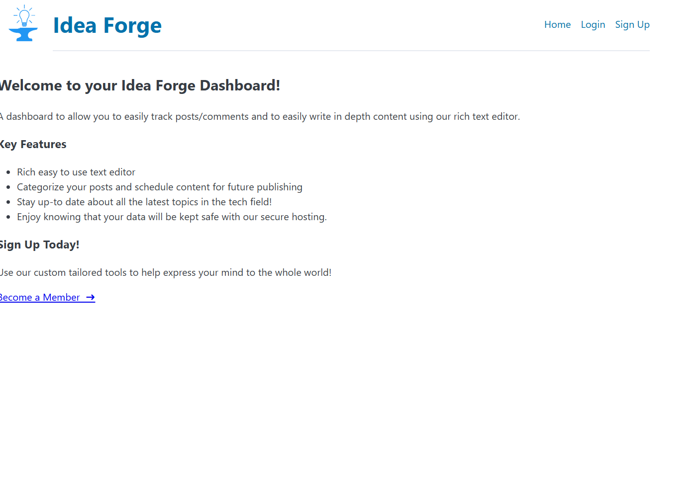
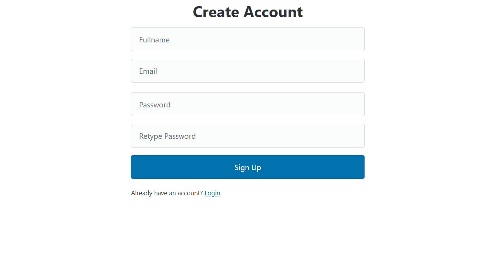
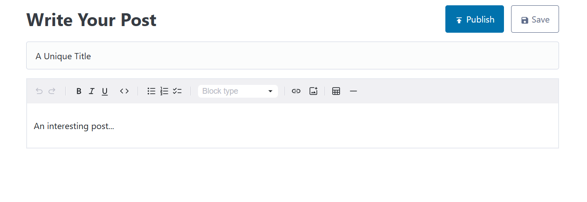

# OdinBlog Dashboard

This repository contains the dashboard for the Blog project, enabling users to manage posts and moderate comments.

- Live Link → [Here](https://blog-member.pages.dev/)
- Blog API created previously [here](https://github.com/wpierce19/Blog-API)
- [Follow this](https://blog-home-4o8.pages.dev/) to show your Blog to the world.

---

## Features

- **Post Management**: Create, edit, publish/unpublish, and delete blog posts.
- **Comment Moderation**: View and delete inappropriate comments.
- **Authentication**: Secure login to access the dashboard.

---

## Technologies Used

- **React.js**: JavaScript library for building user interfaces.
- **React Router**: For handling in-app routing.
- **JWT**: For secure admin authentication.
- **PicoCSS**: Lightweight CSS Library for styling.
- **react-markdown**: JS Library to parse Markdown content.
- **MDXEditor**: Rich Text Editor to write posts.

---

## Installation

### 1. Clone the repository:

```bash
git clone https://github.com/wpierce19/Blog-member.git
cd Blog-member
```

### 2. Install Dependencies:

```bash
npm install
```

### 3. Start the developement server:

```bash
npm run dev
```
The dashboard will be accessible at http://localhost:5173/.


## Screenshots:






